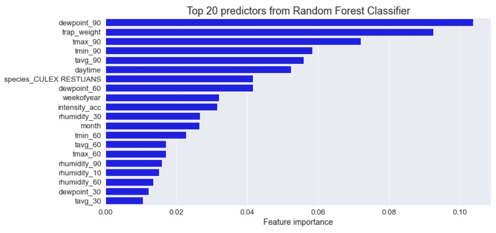

#  Project 4
Zi Xin | Rachel | David | Xavier
# Predicting presence of West Nile Virus in mosquitos

### Introduction

West Nile virus (WNV) is a mosquito-borne infectious disease that flares up during mosquito season from summer to early fall. It first emerged in the eastern U.S. in 1999, and has now become the leading cause of mosquito-borne disease in the continental U.S. [[1]](https://www.cdc.gov/westnile/index.html)

WNV is most commonly spread to humans through infected mosquitos, usually of the genus _Culex_. [[2]](https://www.euro.who.int/__data/assets/pdf_file/0020/246170/Fact-sheet-West-Nile-virus-Eng.pdf) In most cases, WNV infection does not cause symptoms, but up to 20% of people who become infected with the virus develop symptoms ranging from a persistent fever, to serious neurological illnesses that can result in death. Currently, there is no human vaccine against WNV and prevention of the illness in humans is based on mosquito control. [[3]](https://www.euro.who.int/__data/assets/pdf_file/0020/246170/Fact-sheet-West-Nile-virus-Eng.pdf)

In 2002, WNV first hit Chicago with 225 human cases reported that summer. In response, the Chicago Department of Public Health (CDPH) implemented city‐wide surveillance and mosquito control measures, which resulted in a dramatic decline of human cases in subsequent years. Chicago continues to have one of the most ro‐
bust urban mosquito control programs in the country. [[4]](https://www.chicago.gov/content/dam/city/depts/cdph/food_env/general/West_Nile_Virus/WNV_2018databrief_FINALJan102019.pdf)

### Problem Statement

The goal of this project is to assist the City of Chicago a.k.a Windy City and the CDPH in developing a model that can accurately predict when and where different species of mosquitos will test positive for WNV and identify the factors that are the strongest predictors of WNV presence.

If outbreaks of WNV in mosquitos can be reliably predicted, the City of Chicago and CPHD will be able to more efficiently and effectively coordinate resources towards preventing transmission of this potentially deadly virus.

### Problem Approach

Predicting the presence of WNV is a binary classification problem. To that end, we tested several classification models listed below using a total of 66 feature variables. The evaluation metrics used will be AUC score and sensitivity (recall).

- Logistic regression
- Support vector machine
- Bagged decision trees
- Extra trees
- Random forest
- AdaBoost
- Gradient boosting
- XGBoost

## Conclusion and Recommendations

In this analysis, we explored the performance of several models in predicting the presence of WNV in mosquitos. Using AUC score and sensitivity as our main evaluation metrics, the Random Forest classifier, which obtained an AUC score of 0.846 and sensitivity of 0.819, was selected as the final production model.

# 

As seen from the model's top 20 features, factors related to seasonality, weather, location and mosquito species are highly important in predicting the presence of WNV. In particular, seasonality and weather-related features play the biggest role as they made up the majority of the top 20 features. This aligns with the fact the WNV is a seasonal virus that emerges during summer as hot temperatures favour mosquito-breeding.

In our cost-benefit analysis of mosquito spraying, we found that spraying seems to be inversely correlated with WNV incidence. However, we do not have sufficient data at hand to quantify the effectiveness of spraying and thus cannot form a strong conclusion on whether the benefits of spraying are justified by its costs. Furthermore, it is difficult to isolate the effects of spraying as the spread of WNV is also influenced by other variables such as geographical location and weather.

Whilst mosquito spraying certainly has its benefits, it is best for the CDPH to take a multi-pronged approach in tackling WNV. CDPH could drive educational campaigns to teach the community how they can help to prevent mosquito breeding in their homes. For example, ensuring that they remove all standing water so that mosquitos will not lay their eggs there.

For spraying, since WNV incidence is the highest in August, spraying efforts should be concentrated in August for greatest effect.

## Data description

**Train/Test Data** (split into separate train and validation sets for modelling) – Every week from late spring through the fall, mosquitos in traps across the city are tested for presence of WNV. These test results are summarised by date from May 2007 to Oct 2014, trap, and species. Location data is also provided for all the traps.

Train Data consist of information for 2007, 2009, 2011 and 2013, while Test Data consist of information for 2008, 2010, 2012 and 2014.

**Spray Data** – Data is provided for the locations where the City of Chicago did mosquito spraying in 2011 and 2013. Spraying can reduce the number of mosquitos in the area, and therefore might eliminate the appearance of WNV.

**Weather data** – Daily weather records are provided for the period 2007 to 2014 from 2 weather stations. Hot and dry weather conditions are conducive for a seasonal virus like WNV, and it is worth using weather data to improve the prediction of WNV presence.

## Data dictionary

| Feature                      | Variable type | Datatype | Dataset            | Description                                                                     |
|------------------------------|---------------|----------|--------------------|---------------------------------------------------------------------------------|
| Id                           | Norminal      | int64    | test               |  the id of the record                                                           |
| Date                         | datetime      | datetime | train and test     | date that the WNV test is performed                                             |
| Address                      | Norminal      | object   | train and test     | approximate address of the location of trap                                     |
| Species                      | Norminal      | object   | train and test     | species of mosquito                                                             |
| Block                        | Norminal      | int64    | train and test     | block number of address                                                         |
| Street                       | Norminal      | object   | train and test     | Street name                                                                     |
| Trap                         | Norminal      | object   | train and test     | Id of the trap                                                                  |
| AddressNumberAndStreet       | Norminal      | object   | train and test     | approximate address returned from GeoCoder                                      |
| Latitude                     | continuous    | float64  | train and test     | Latitude  returned from GeoCoder                                                |
| Longitude                    | continuous    | float64  | train and test     | Longitude returned from GeoCoder                                                |
| AddressAccuracy              | Norminal      | int64    | train and test     | accuracy returned from GeoCoder                                                 |
| NumMosquitos                 | discrete      | int64    | train and test     | number of mosquitoes caught in this trap                                        |
| WnvPresent                   | discrete      | int64    | train and test     | 1 means WNV is present, and 0 means not present.                                |
| Station                      | discrete      | int64    | weather            | Station 1 or 2 where weather data is collected                                  |
| Date                         | datetime      | datetime | weather            | Date of weather record                                                          |
| Tmax                         | discrete      | int64    | weather            | Max temperature in Fahrenheit                                                   |
| Tmin                         | discrete      | int64    | weather            | Min temperature in Fahrenheit                                                   |
| Tavg                         | continuous    | float64  | weather            | Avg temperature in Fahrenheit                                                   |
| Depart                       | discrete      | float64  | weather            | The difference from normal temperatures for the last 30yrs                      |
| DewPoint                     | discrete      | int64    | weather            | Dew Point temperature                                                           |
| WetBulb                      | discrete      | int64    | weather            | Web Bulb temperature                                                            |
| Heat                         | continuous    | float64  | weather            | Difference between daily avg temperature and 65 Deg F                           |
| Cool                         | continuous    | float64  | weather            | Difference between daily avg temperature and 65 Deg F                           |
| Sunrise                      | datetime      | datetime | weather            | Sunrise timing                                                                  |
| Sunset                       | datetime      | datetime | weather            | Sunset timing                                                                   |
| CodeSum                      | norminal      | object   | weather            | Weather Phenomena                                                               |
| Depth                        | continuous    | float64  | weather            | Snow inches                                                                     |
| Water1                       | continuous    | float64  | weather            | Snow/Ice on ground                                                              |
| SnowFall                     | continuous    | float64  | weather            | Snowfall in inches                                                              |
| PrecipTotal                  | continuous    | float64  | weather            | Rainfall and melted snow (inches)                                               |
| StnPressure                  | continuous    | float64  | weather            | Avg Station Pressure                                                            |
| SeaLevel                     | continuous    | float64  | weather            | Avg Sea level Presure                                                           |
| ResultSpeed                  | continuous    | float64  | weather            | Resultant Wind Speed                                                            |
| ResultDir                    | continuous    | int64    | weather            | Resultant Wind Direction                                                        |
| AvgSpeed                     | continuous    | float64  | weather            | Avg WInd Speed                                                                  |
| Date                         | datetime      | datetime | spray              | Date of the spray                                                               |
| Time                         | datetime      | datetime | spray              | Time of the spray                                                               |
| Latitude                     | continuous    | float64  | spray              | Latitude of the spray                                                           |
| Longitude                    | continuous    | float64  | spray              | Latitude of the spray                                                           |
| year                         | discrete      | int64    | engineered feature | year corresponding in train data                                                |
| month                        | discrete      | int64    | engineered feature | month corresponding in train data                                               |
| weekofyear                   | discrete      | int64    | engineered feature | week of the year corresponding in train data                                    |
| yearmonth                    | norminal      | object   | engineered feature | yearmonth string corresponding in train data                                    |
| weekday                      | discrete      | int64    | engineered feature | weekday corresponding in train data                                             |
| closest_station              | discrete      | int64    | engineered feature | the closer weather station to each trap                                         |
| row_count                    | discrete      | int64    | engineered feature | number of "duplicate" rowsto get an estimate for nummosquitos                   |
| intensity_acc                | continuous    | float64  | engineered feature | calculates the "intensity" of a spray for each observation in the train dataset |
| daytime                      | discrete      | int32    | engineered feature | total number of minutes from Sunrise to Sunset                                  |
| trap_weight                  | continuous    | float64  | engineered feature | weightage of the trap based on Wnvpresent/no. of times sampled                  |
| rhumidity                    | continuous    | float64  | engineered feature | relative humidity derived from dewpoint and tavg                                |
| tavg_7/10/14/30/60/90        | continuous    | float64  | engineered feature | Rolling temp averages for 7, 10, 14, 30, 60, 90 days                            |
| resultspeed_7/10/14/30/60/90 | continuous    | float64  | engineered feature | Rolling wind speed averages for 7, 10, 14, 30, 60, 90 days                      |
| dewpoint_7/10/14/30/60/90    | continuous    | float64  | engineered feature | Rolling dewpoint averages for 7, 10, 14, 30, 60, 90 days                        |
| rhumidity_7/10/14/30/60/90   | continuous    | float64  | engineered feature | Rolling relative humidity averages for 7, 10, 14, 30, 60, 90 days               |
| tmax_7/10/14/30/60/90        | continuous    | float64  | engineered feature | Rolling max temp averages for 7, 10, 14, 30, 60, 90 days                        |
| tmin_7/10/14/30/60/90        | continuous    | float64  | engineered feature | Rolling min temp averages for 7, 10, 14, 30, 60, 90 days                        |
| preciptotal_7/10/14/30/60/90 | continuous    | float64  | engineered feature | Rolling preciptotal averages for 7, 10, 14, 30, 60, 90 days                     |
